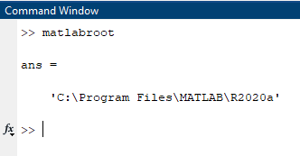
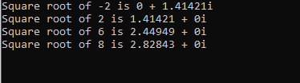
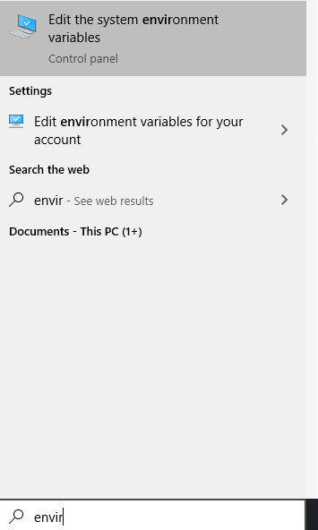
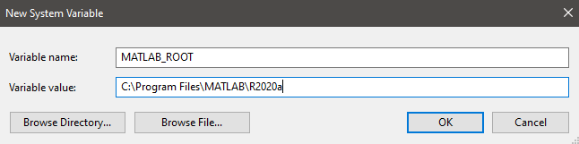

# Visual Studio With Matlab
This repo is mostly for setting up a Visual Studio project to work with the Matlab Engine.
This information was obtained from [this helpful post.](https://www.mathworks.com/matlabcentral/answers/467518-how-can-i-build-a-c-program-using-matlab-engine-in-visual-studio)
## Requirements
* Matlab installed
  * Matlab R2020a was used. Other versions should work
* Visual Studio 2017 or higher
  * Visual Studio 2019 Community edition was used.
* Windows 64-bit computer
  * Used Windows 10 Version	10.0.18363 Build 18363
## Setting up the Environment
1. Enter `matlabroot` into the Matlab command prompt to obtain the root directory of Matlab
    * Example response `C:\Program Files\MATLAB\R2020a`  
  
2. Add MATLAB_ROOT to the environment variables with the path obtained from the above Matlab command. Look at [Setting up Environment Variables](#heading-4 "Goto Environment Variable setup") for more help
3. Clone this repository using `git clone https://github.com/blaksmith205/cpp-with-matlab.git` in the git bash terminal
4. Open up the cloned .sln file with Visual Studio
5. Change the release version to x64
5. Right click cpp-with-matlab project in solution explorer then select 'properties'
6. Under the 'Debugging' tab, enter `PATH=%(MATLAB_ROOT)\extern\bin\win64;%PATH%` into the 'Environment' field
7. Open test_env.cpp and add a breakpoint to line 34
8. If everything was setup correctly, when you run the local windows debugger, you should get an output like this in the command prompt:  
  
## Setting up Environment Variables
### On Windows 10
1. Type `envir` into the Windows search bar.
2. Select Edit the System Environment variables option  
  
3. Click on Environment Variables in the System Properties Window
4. Under the System Variables section, click on 'New...' button
5. Enter `MATLAB_ROOT` into the Variable name field and the path obtained by `matlabroot` command  
  
6. Click 'Ok' to add the variable, then again to close the Environment Variables window.
